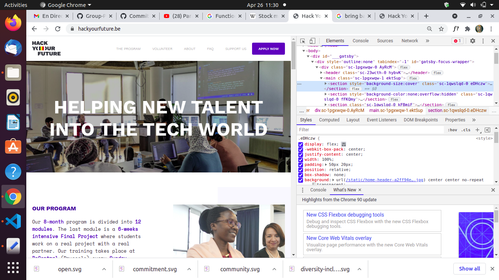
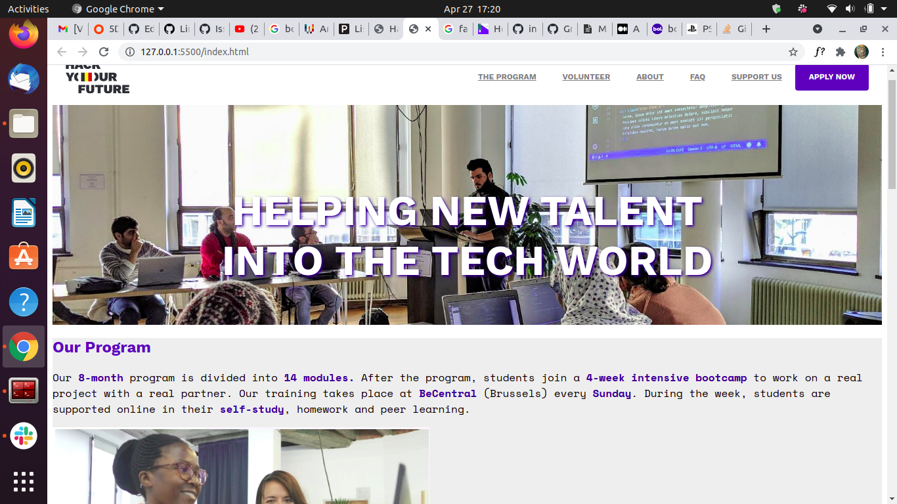
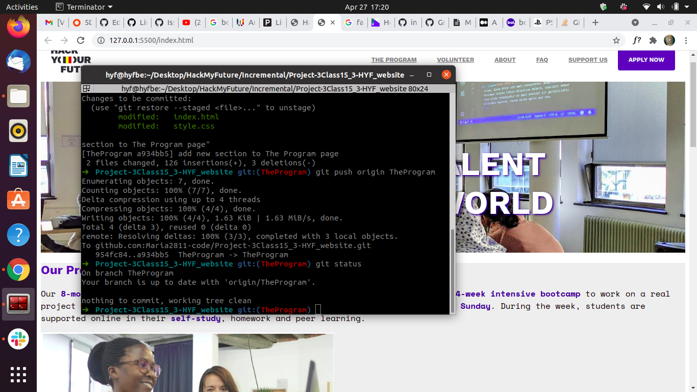
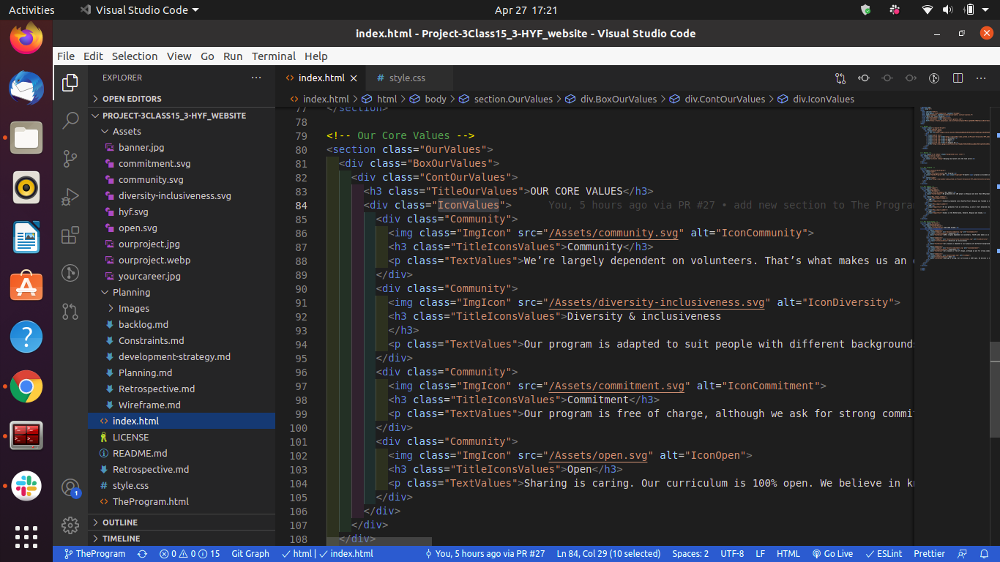
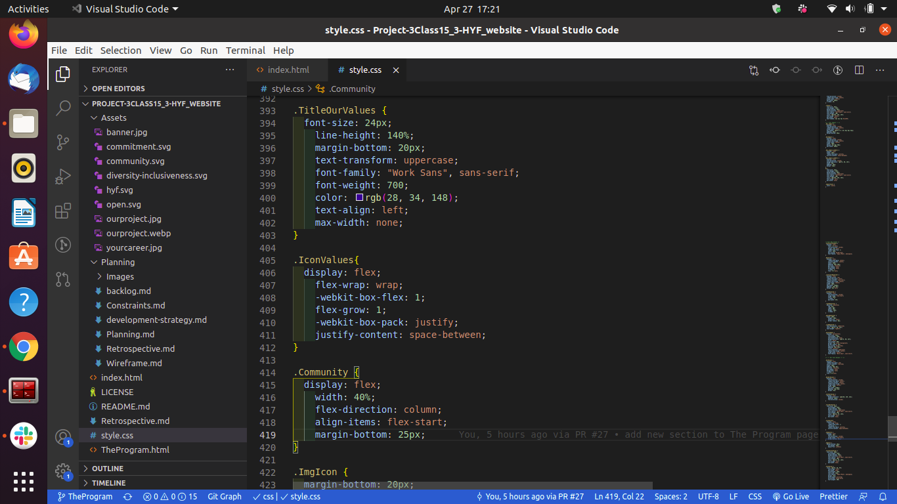

# Group 3 Project  
*__Team members:__*  
- [Osimef849](https://github.com/Osimef849)  
- [RosaMoran](https://github.com/RosaMoran)  
- [SerkanDemir86](https://github.com/SerkanDemir86)  
- [Hajir-pro](https://github.com/Hajir-pro)  
- [WalterAlvar](https://github.com/WalterAlvar)  
- [Maria2811-code](https://github.com/Maria2811-code)  

You can check the result with this [live demo](https://maria2811-code.github.io/Project-3Class15_3-HYF_website/)  
You can check the original [repo](https://github.com/Maria2811-code/Project-3Class15_3-HYF_website/tree/main)

## The Mission
This is our attempt to reverse engineering [Hack Your Future.be](https://hackyourfuture.be/). It is our second group project in order to learn the next subjects:

- __Incremental Development__ working a single remote Repo, from each group member's laptop.
- __Agile__ methodology is the way we work, adding small steps and performing regular meetings to learn from each other: 
  - This also help us to understand GitHub features as a tool to manage a group project.
  - It is our first aproaching into work through CLI
  - The importance of a well done Development Strategy and the whole plannification process.

### The Technology  

- __HTML & CSS__ to buit the whole website.
- __Git & GitHub__ for managing the versions and store the repo.
- __DevTools__ for inspecting the real website and understanding the flow.
- __Visual Studio Code__ and all the useful extensions for make our lives easiest.

### Screenshots

This is a little **"Making Of Process"** or *our current life with the laptop as a friend:*

  
  
  
  

